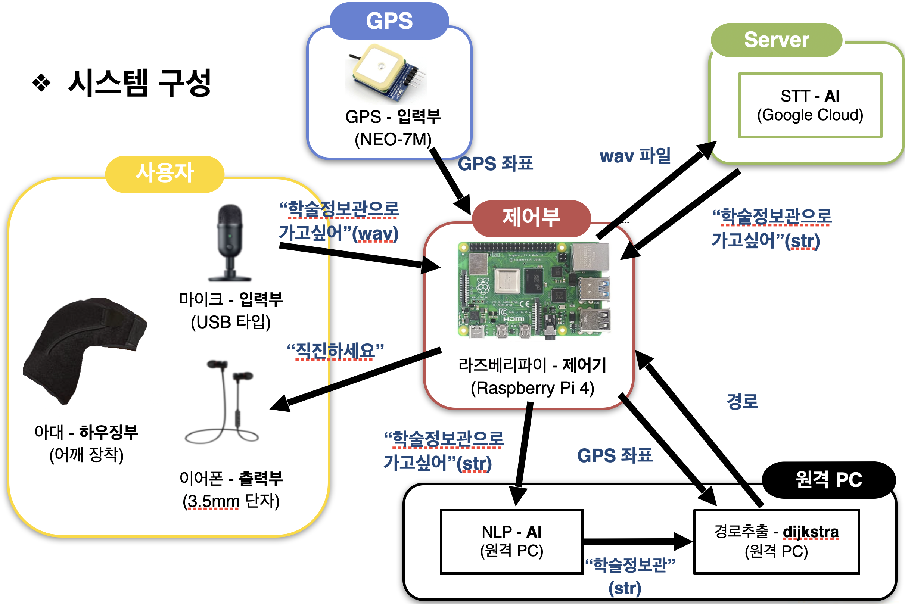

# Blind Navigation System (Capstone Project)

본 프로젝트는 **시각장애인을 위한 내비게이션 시스템**을 목표로 한 캡스톤 디자인 결과물입니다.  
Raspberry Pi 기반 임베디드 시스템에서 GPS, 음성 인식, 자연어 처리, 실시간 경로 탐색을 통합하여 사용자가 목적지까지 안전하게 이동할 수 있도록 지원합니다.

---

## 1. Project Overview
- **목표**: 시각장애인이 실내외 환경에서 안전하게 이동할 수 있도록 경로 안내 시스템 구현
- **주요 기능**
  - 음성 명령(STT) → 목적지/회피지 추출(NLP) → 경로 탐색(Dijkstra) → 실시간 안내
  - 실시간 GPS 기반 경로 이탈 감지 및 재탐색
  - 위험 구역(계단/공사 등)을 고려한 경로 우회
  - 음성/진동 피드백으로 다중 모달 안내 제공

### System Architecture

---

## 2. AI Module: Natural Language Understanding

### Approach
1. **STT (Speech-to-Text)**
   - OpenAI Whisper를 활용하여 한국어/영어 음성을 텍스트로 변환

2. **Text Preprocessing**
   - KoNLPy(Okt) 형태소 분석기로 문장을 토큰화
   - BIO 태깅 스킴을 적용하여 개체와 속성(positive/negative)을 라벨링

3. **Sequence Tagging Models**
   - **BiLSTM 모델**
     - LSTM 게이팅 구조로 장기 의존성 문제(vanishing gradient) 완화
     - 양방향(Bi-directional) 구조로 단방향 한계를 보완
   - **mBERT 모델**
     - Hugging Face Transformers 기반 멀티링구얼 BERT
     - 한국어 포함 다국어 문맥 이해 강화

4. **Postprocessing**
   - 태깅된 결과를 기반으로 장소를 목적지(positive)와 회피지(negative)로 분류
   - 후처리 단계에서 “~로 이동(목적지)” / “~은 회피(부정)” 형태의 명령어 생성

### Tech Stack (AI)
- Speech Recognition: OpenAI Whisper  
- Tokenization: KoNLPy (Okt)  
- Models: BiLSTM (TensorFlow/Keras 2.8), BERT (Transformers)  
- Labeling Scheme: BIO tagging (B-LOC-POS / B-LOC-NEG 등)  
- Data Processing: Python, Jupyter Notebook, MeCab  
- Place Lookup: Naver Local API  

---

## 3. Runtime & Communication

### 주요 구조
1. **멀티스레딩**
   - Thread-1: 음성 녹음 → STT → 서버에 경로 요청 → 안내 지시 출력
   - Thread-2: GPS 모듈로부터 지속적으로 위도/경도 수집
   - 두 스레드를 병렬로 실행하여 실시간 응답성 확보

2. **라이포큐 (LifoQueue) 기반 좌표 관리**
   - 최신 GPS 좌표만 활용하기 위해 LIFO 큐 사용
   - 오래된 좌표는 자동 폐기 → 최신 데이터 중심의 실시간성 강화

3. **TCP 소켓 통신**
   - Raspberry Pi → 서버 간 TCP/IP 통신
   - 전송: `"<사용자 명령문>|<위도>|<경도>"`
   - 응답: 최단 경로 노드 시퀀스 문자열

4. **실시간 대응**
   - 경로 이탈 감지 시 즉시 재탐색 요청
   - 위험 구역 진입 시 경고음 출력
   - 방위각 기반 규칙으로 단순 명확한 지시어 생성

### Tech Stack (Runtime & Communication)
- Python 3  
- Threading: `threading`, `queue.LifoQueue`  
- GPS: `pyserial`(UART `/dev/ttyAMA0`), `pynmea2`  
- Networking: Python `socket` (TCP client)  
- Audio I/O: `pyaudio`, `wave`, `pydub`  
- STT: Google Cloud Speech-to-Text (ko-KR)  
- OS: Raspbian (Raspberry Pi Linux)  

---

## 4. Navigation Model

### 경로 탐색 및 관리
1. **노드 그래프 구성**
   - 캠퍼스 내 지점을 노드로 정의, 보행 가능 경로를 간선으로 연결
   - 위험 구간은 비용 가중치↑로 설정해 경로 우회 유도

2. **거리 계산 (Haversine)**
   - 위도/경도 좌표를 구면 좌표로 변환해 실제 거리 계산
   - 경로 비용 및 이탈 감지에 활용

3. **최단경로 탐색 (Dijkstra)**
   - 출발/도착 노드를 기반으로 최단 경로 계산
   - 위험구역은 패널티 적용하여 경로 후보에서 배제

4. **실시간 진행/지시**
   - 최신 GPS 좌표와 다음 노드 간 방위각 계산
   - 각도 차로 전진/좌회전/우회전/U턴 지시어 생성

5. **이탈 감지 & 재탐색**
   - 사용자가 경로에서 벗어나면 즉시 서버에 재탐색 요청

6. **GPS 필터링 (예정)**
   - Kalman Filter(C 구현)를 적용해 GPS 잡음을 줄이는 기능 준비
   - 시간 부족으로 최종 릴리스에는 미포함

### Tech Stack (Navigation)
- Algorithms: Dijkstra, Haversine distance, Bearing  
- Language: Python 3, C (Kalman filter prototype)  
- Math/Geo: Custom 구현  

---

## 5. Results
- Whisper + NLP 모델로 음성 기반 목적지/회피지 추출 성공  
- GPS 스트림을 통한 실시간 위치 추적 및 경로 안내 동작 검증  
- 이탈 감지 및 즉시 재탐색 동작 확인  
- 위험 구역 패널티 적용 시 안전 경로 우회 성공  

---

## 6. What I Learned
- **임베디드 환경에서 AI·네트워크·GPS 통합 경험**  
- **실시간 시스템 설계**: 멀티스레드, 큐 관리, TCP 통신  
- **경로 탐색 알고리즘 구현 및 실제 적용 경험**  
- **사용자 안전성을 고려한 시스템 설계** (위험 구역 회피, 음성 안내)  
- **협업 문서화 경험**: 하드웨어/소프트웨어 모듈별 설계 및 통합  

---

## 7. Future Work
- Kalman Filter 적용 → GPS 정확도 향상  
- 지도 데이터 기반 경로 최적화  
- 음성 안내 고도화 (자연어 처리 심화 적용)  
- 다중 센서 융합(IMU 등)으로 방향 안정성 확보  

---

## 8. Team

본 프로젝트는 한양대학교 ERICA 전자공학부 캡스톤 디자인 수업에서 00팀이 공동으로 수행했습니다.

- 팀장: 홍길동 (시스템 통합, 문서화)  
- 팀원: 김철수 (임베디드 SW, GPS)  
- 팀원: 박영희 (AI 모듈, NLP)  
- 팀원: 박주형 (네비게이션 모델, 통신 구조)  

> 협업을 통해 실제 사용자 중심의 시스템을 설계하며, 기술적 성취뿐 아니라 팀워크의 중요성을 배웠습니다.
